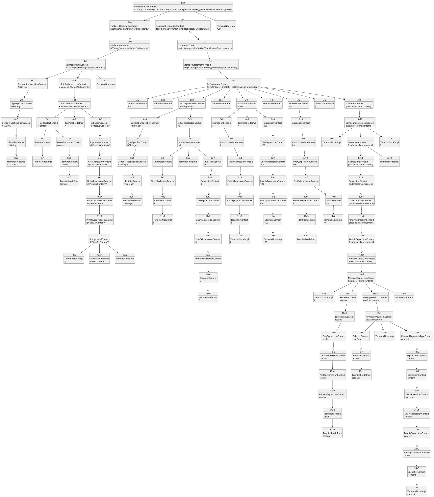

```plantuml
@startuml

object 0x0
0x0 : TranslationUnitContext
0x0 : NSString*content=@\"testStrContent\";for(NSIntegeri=0;i<100;i++){[testInstestFunc:content];}<EOF>

object 1x0
1x0 : TopLevelDeclarationContext
1x0 : NSString*content=@\"testStrContent\";

object 1x1
1x1 : TopLevelDeclarationContext
1x1 : for(NSIntegeri=0;i<100;i++){[testInstestFunc:content];}

object 1x2
1x2 : TerminalNodeImpl
1x2 : <EOF>

object 2x0
2x0 : DeclarationContext
2x0 : NSString*content=@\"testStrContent\";

object 2x1
2x1 : StatementContext
2x1 : for(NSIntegeri=0;i<100;i++){[testInstestFunc:content];}

object 3x0
3x0 : VarDeclarationContext
3x0 : NSString*content=@\"testStrContent\";

object 3x1
3x1 : IterationStatementContext
3x1 : for(NSIntegeri=0;i<100;i++){[testInstestFunc:content];}

object 4x0
4x0 : DeclarationSpecifiersContext
4x0 : NSString

object 4x1
4x1 : InitDeclaratorListContext
4x1 : *content=@\"testStrContent\"

object 4x2
4x2 : TerminalNodeImpl
4x2 : ;

object 4x3
4x3 : ForStatementContext
4x3 : for(NSIntegeri=0;i<100;i++){[testInstestFunc:content];}

object 5x0
5x0 : TypeSpecifierContext
5x0 : NSString

object 5x1
5x1 : InitDeclaratorContext
5x1 : *content=@\"testStrContent\"

object 5x2
5x2 : TerminalNodeImpl
5x2 : for

object 5x3
5x3 : TerminalNodeImpl
5x3 : (

object 5x4
5x4 : ForLoopInitializerContext
5x4 : NSIntegeri=0

object 5x5
5x5 : TerminalNodeImpl
5x5 : ;

object 5x6
5x6 : ExpressionContext
5x6 : i<100

object 5x7
5x7 : TerminalNodeImpl
5x7 : ;

object 5x8
5x8 : ExpressionsContext
5x8 : i++

object 5x9
5x9 : TerminalNodeImpl
5x9 : )

object 5x10
5x10 : StatementContext
5x10 : {[testInstestFunc:content];}

object 6x0
6x0 : GenericTypeSpecifierContext
6x0 : NSString

object 6x1
6x1 : DeclaratorContext
6x1 : *content

object 6x2
6x2 : TerminalNodeImpl
6x2 : =

object 6x3
6x3 : InitializerContext
6x3 : @\"testStrContent\"

object 6x4
6x4 : DeclarationSpecifiersContext
6x4 : NSInteger

object 6x5
6x5 : InitDeclaratorListContext
6x5 : i=0

object 6x6
6x6 : ExpressionContext
6x6 : i

object 6x7
6x7 : TerminalNodeImpl
6x7 : <

object 6x8
6x8 : ExpressionContext
6x8 : 100

object 6x9
6x9 : ExpressionContext
6x9 : i++

object 6x10
6x10 : CompoundStatementContext
6x10 : {[testInstestFunc:content];}

object 7x0
7x0 : IdentifierContext
7x0 : NSString

object 7x1
7x1 : PointerContext
7x1 : *

object 7x2
7x2 : DirectDeclaratorContext
7x2 : content

object 7x3
7x3 : ExpressionContext
7x3 : @\"testStrContent\"

object 7x4
7x4 : TypeSpecifierContext
7x4 : NSInteger

object 7x5
7x5 : InitDeclaratorContext
7x5 : i=0

object 7x6
7x6 : CastExpressionContext
7x6 : i

object 7x7
7x7 : CastExpressionContext
7x7 : 100

object 7x8
7x8 : CastExpressionContext
7x8 : i++

object 7x9
7x9 : TerminalNodeImpl
7x9 : {

object 7x10
7x10 : StatementContext
7x10 : [testInstestFunc:content];

object 7x11
7x11 : TerminalNodeImpl
7x11 : }

object 8x0
8x0 : TerminalNodeImpl
8x0 : NSString

object 8x1
8x1 : TerminalNodeImpl
8x1 : *

object 8x2
8x2 : IdentifierContext
8x2 : content

object 8x3
8x3 : CastExpressionContext
8x3 : @\"testStrContent\"

object 8x4
8x4 : GenericTypeSpecifierContext
8x4 : NSInteger

object 8x5
8x5 : DeclaratorContext
8x5 : i

object 8x6
8x6 : TerminalNodeImpl
8x6 : =

object 8x7
8x7 : InitializerContext
8x7 : 0

object 8x8
8x8 : UnaryExpressionContext
8x8 : i

object 8x9
8x9 : UnaryExpressionContext
8x9 : 100

object 8x10
8x10 : UnaryExpressionContext
8x10 : i++

object 8x11
8x11 : ExpressionsContext
8x11 : [testInstestFunc:content]

object 8x12
8x12 : TerminalNodeImpl
8x12 : ;

object 9x0
9x0 : TerminalNodeImpl
9x0 : content

object 9x1
9x1 : UnaryExpressionContext
9x1 : @\"testStrContent\"

object 9x2
9x2 : IdentifierContext
9x2 : NSInteger

object 9x3
9x3 : DirectDeclaratorContext
9x3 : i

object 9x4
9x4 : ExpressionContext
9x4 : 0

object 9x5
9x5 : PostfixExpressionContext
9x5 : i

object 9x6
9x6 : PostfixExpressionContext
9x6 : 100

object 9x7
9x7 : PostfixExpressionContext
9x7 : i++

object 9x8
9x8 : ExpressionContext
9x8 : [testInstestFunc:content]

object 10x0
10x0 : PostfixExpressionContext
10x0 : @\"testStrContent\"

object 10x1
10x1 : TerminalNodeImpl
10x1 : NSInteger

object 10x2
10x2 : IdentifierContext
10x2 : i

object 10x3
10x3 : CastExpressionContext
10x3 : 0

object 10x4
10x4 : PrimaryExpressionContext
10x4 : i

object 10x5
10x5 : PrimaryExpressionContext
10x5 : 100

object 10x6
10x6 : PrimaryExpressionContext
10x6 : i

object 10x7
10x7 : PostfixContext
10x7 : ++

object 10x8
10x8 : CastExpressionContext
10x8 : [testInstestFunc:content]

object 11x0
11x0 : PrimaryExpressionContext
11x0 : @\"testStrContent\"

object 11x1
11x1 : TerminalNodeImpl
11x1 : i

object 11x2
11x2 : UnaryExpressionContext
11x2 : 0

object 11x3
11x3 : IdentifierContext
11x3 : i

object 11x4
11x4 : ConstantContext
11x4 : 100

object 11x5
11x5 : IdentifierContext
11x5 : i

object 11x6
11x6 : TerminalNodeImpl
11x6 : ++

object 11x7
11x7 : UnaryExpressionContext
11x7 : [testInstestFunc:content]

object 12x0
12x0 : StringLiteralContext
12x0 : @\"testStrContent\"

object 12x1
12x1 : PostfixExpressionContext
12x1 : 0

object 12x2
12x2 : TerminalNodeImpl
12x2 : i

object 12x3
12x3 : TerminalNodeImpl
12x3 : 100

object 12x4
12x4 : TerminalNodeImpl
12x4 : i

object 12x5
12x5 : PostfixExpressionContext
12x5 : [testInstestFunc:content]

object 13x0
13x0 : TerminalNodeImpl
13x0 : @\"

object 13x1
13x1 : TerminalNodeImpl
13x1 : testStrContent

object 13x2
13x2 : TerminalNodeImpl
13x2 : \"

object 13x3
13x3 : PrimaryExpressionContext
13x3 : 0

object 13x4
13x4 : PrimaryExpressionContext
13x4 : [testInstestFunc:content]

object 14x0
14x0 : ConstantContext
14x0 : 0

object 14x1
14x1 : MessageExpressionContext
14x1 : [testInstestFunc:content]

object 15x0
15x0 : TerminalNodeImpl
15x0 : 0

object 15x1
15x1 : TerminalNodeImpl
15x1 : [

object 15x2
15x2 : ReceiverContext
15x2 : testIns

object 15x3
15x3 : MessageSelectorContext
15x3 : testFunc:content

object 15x4
15x4 : TerminalNodeImpl
15x4 : ]

object 16x0
16x0 : ExpressionContext
16x0 : testIns

object 16x1
16x1 : KeywordArgumentContext
16x1 : testFunc:content

object 17x0
17x0 : CastExpressionContext
17x0 : testIns

object 17x1
17x1 : SelectorContext
17x1 : testFunc

object 17x2
17x2 : TerminalNodeImpl
17x2 : :

object 17x3
17x3 : KeywordArgumentTypeContext
17x3 : content

object 18x0
18x0 : UnaryExpressionContext
18x0 : testIns

object 18x1
18x1 : IdentifierContext
18x1 : testFunc

object 18x2
18x2 : ExpressionsContext
18x2 : content

object 19x0
19x0 : PostfixExpressionContext
19x0 : testIns

object 19x1
19x1 : TerminalNodeImpl
19x1 : testFunc

object 19x2
19x2 : ExpressionContext
19x2 : content

object 20x0
20x0 : PrimaryExpressionContext
20x0 : testIns

object 20x1
20x1 : CastExpressionContext
20x1 : content

object 21x0
21x0 : IdentifierContext
21x0 : testIns

object 21x1
21x1 : UnaryExpressionContext
21x1 : content

object 22x0
22x0 : TerminalNodeImpl
22x0 : testIns

object 22x1
22x1 : PostfixExpressionContext
22x1 : content

object 23x0
23x0 : PrimaryExpressionContext
23x0 : content

object 24x0
24x0 : IdentifierContext
24x0 : content

object 25x0
25x0 : TerminalNodeImpl
25x0 : content

0x0 --> 1x0
0x0 --> 1x1
0x0 --> 1x2
1x0 --> 2x0
1x1 --> 2x1
2x0 --> 3x0
2x1 --> 3x1
3x0 --> 4x0
3x0 --> 4x1
3x0 --> 4x2
3x1 --> 4x3
4x0 --> 5x0
4x1 --> 5x1
4x3 --> 5x2
4x3 --> 5x3
4x3 --> 5x4
4x3 --> 5x5
4x3 --> 5x6
4x3 --> 5x7
4x3 --> 5x8
4x3 --> 5x9
4x3 --> 5x10
5x0 --> 6x0
5x1 --> 6x1
5x1 --> 6x2
5x1 --> 6x3
5x4 --> 6x4
5x4 --> 6x5
5x6 --> 6x6
5x6 --> 6x7
5x6 --> 6x8
5x8 --> 6x9
5x10 --> 6x10
6x0 --> 7x0
6x1 --> 7x1
6x1 --> 7x2
6x3 --> 7x3
6x4 --> 7x4
6x5 --> 7x5
6x6 --> 7x6
6x8 --> 7x7
6x9 --> 7x8
6x10 --> 7x9
6x10 --> 7x10
6x10 --> 7x11
7x0 --> 8x0
7x1 --> 8x1
7x2 --> 8x2
7x3 --> 8x3
7x4 --> 8x4
7x5 --> 8x5
7x5 --> 8x6
7x5 --> 8x7
7x6 --> 8x8
7x7 --> 8x9
7x8 --> 8x10
7x10 --> 8x11
7x10 --> 8x12
8x2 --> 9x0
8x3 --> 9x1
8x4 --> 9x2
8x5 --> 9x3
8x7 --> 9x4
8x8 --> 9x5
8x9 --> 9x6
8x10 --> 9x7
8x11 --> 9x8
9x1 --> 10x0
9x2 --> 10x1
9x3 --> 10x2
9x4 --> 10x3
9x5 --> 10x4
9x6 --> 10x5
9x7 --> 10x6
9x7 --> 10x7
9x8 --> 10x8
10x0 --> 11x0
10x2 --> 11x1
10x3 --> 11x2
10x4 --> 11x3
10x5 --> 11x4
10x6 --> 11x5
10x7 --> 11x6
10x8 --> 11x7
11x0 --> 12x0
11x2 --> 12x1
11x3 --> 12x2
11x4 --> 12x3
11x5 --> 12x4
11x7 --> 12x5
12x0 --> 13x0
12x0 --> 13x1
12x0 --> 13x2
12x1 --> 13x3
12x5 --> 13x4
13x3 --> 14x0
13x4 --> 14x1
14x0 --> 15x0
14x1 --> 15x1
14x1 --> 15x2
14x1 --> 15x3
14x1 --> 15x4
15x2 --> 16x0
15x3 --> 16x1
16x0 --> 17x0
16x1 --> 17x1
16x1 --> 17x2
16x1 --> 17x3
17x0 --> 18x0
17x1 --> 18x1
17x3 --> 18x2
18x0 --> 19x0
18x1 --> 19x1
18x2 --> 19x2
19x0 --> 20x0
19x2 --> 20x1
20x0 --> 21x0
20x1 --> 21x1
21x0 --> 22x0
21x1 --> 22x1
22x1 --> 23x0
23x0 --> 24x0
24x0 --> 25x0


@enduml
```