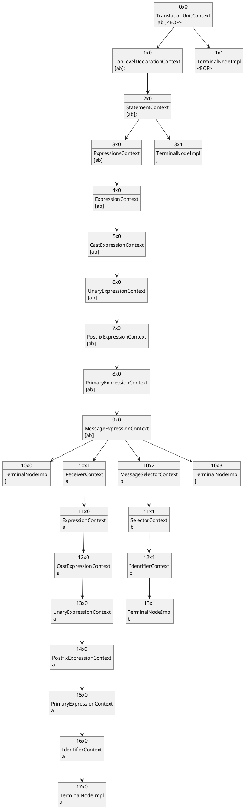

```puml
@startuml

object 0x0
0x0 : TranslationUnitContext
0x0 : [ab];<EOF>

object 1x0
1x0 : TopLevelDeclarationContext
1x0 : [ab];

object 1x1
1x1 : TerminalNodeImpl
1x1 : <EOF>

object 2x0
2x0 : StatementContext
2x0 : [ab];

object 3x0
3x0 : ExpressionsContext
3x0 : [ab]

object 3x1
3x1 : TerminalNodeImpl
3x1 : ;

object 4x0
4x0 : ExpressionContext
4x0 : [ab]

object 5x0
5x0 : CastExpressionContext
5x0 : [ab]

object 6x0
6x0 : UnaryExpressionContext
6x0 : [ab]

object 7x0
7x0 : PostfixExpressionContext
7x0 : [ab]

object 8x0
8x0 : PrimaryExpressionContext
8x0 : [ab]

object 9x0
9x0 : MessageExpressionContext
9x0 : [ab]

object 10x0
10x0 : TerminalNodeImpl
10x0 : [

object 10x1
10x1 : ReceiverContext
10x1 : a

object 10x2
10x2 : MessageSelectorContext
10x2 : b

object 10x3
10x3 : TerminalNodeImpl
10x3 : ]

object 11x0
11x0 : ExpressionContext
11x0 : a

object 11x1
11x1 : SelectorContext
11x1 : b

object 12x0
12x0 : CastExpressionContext
12x0 : a

object 12x1
12x1 : IdentifierContext
12x1 : b

object 13x0
13x0 : UnaryExpressionContext
13x0 : a

object 13x1
13x1 : TerminalNodeImpl
13x1 : b

object 14x0
14x0 : PostfixExpressionContext
14x0 : a

object 15x0
15x0 : PrimaryExpressionContext
15x0 : a

object 16x0
16x0 : IdentifierContext
16x0 : a

object 17x0
17x0 : TerminalNodeImpl
17x0 : a

0x0 --> 1x0
0x0 --> 1x1
1x0 --> 2x0
2x0 --> 3x0
2x0 --> 3x1
3x0 --> 4x0
4x0 --> 5x0
5x0 --> 6x0
6x0 --> 7x0
7x0 --> 8x0
8x0 --> 9x0
9x0 --> 10x0
9x0 --> 10x1
9x0 --> 10x2
9x0 --> 10x3
10x1 --> 11x0
10x2 --> 11x1
11x0 --> 12x0
11x1 --> 12x1
12x0 --> 13x0
12x1 --> 13x1
13x0 --> 14x0
14x0 --> 15x0
15x0 --> 16x0
16x0 --> 17x0


@enduml
```