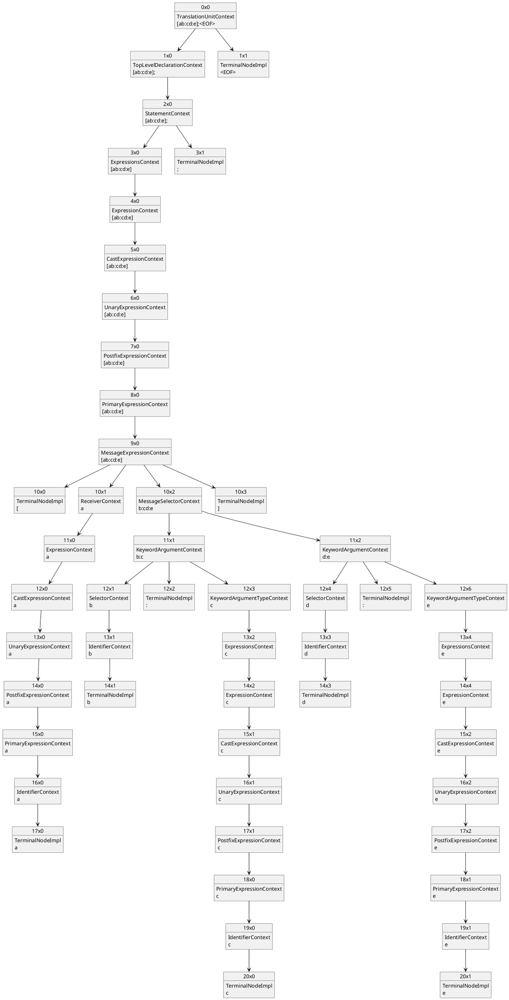

```plantuml
@startuml

object 0x0
0x0 : TranslationUnitContext
0x0 : [ab:cd:e];<EOF>

object 1x0
1x0 : TopLevelDeclarationContext
1x0 : [ab:cd:e];

object 1x1
1x1 : TerminalNodeImpl
1x1 : <EOF>

object 2x0
2x0 : StatementContext
2x0 : [ab:cd:e];

object 3x0
3x0 : ExpressionsContext
3x0 : [ab:cd:e]

object 3x1
3x1 : TerminalNodeImpl
3x1 : ;

object 4x0
4x0 : ExpressionContext
4x0 : [ab:cd:e]

object 5x0
5x0 : CastExpressionContext
5x0 : [ab:cd:e]

object 6x0
6x0 : UnaryExpressionContext
6x0 : [ab:cd:e]

object 7x0
7x0 : PostfixExpressionContext
7x0 : [ab:cd:e]

object 8x0
8x0 : PrimaryExpressionContext
8x0 : [ab:cd:e]

object 9x0
9x0 : MessageExpressionContext
9x0 : [ab:cd:e]

object 10x0
10x0 : TerminalNodeImpl
10x0 : [

object 10x1
10x1 : ReceiverContext
10x1 : a

object 10x2
10x2 : MessageSelectorContext
10x2 : b:cd:e

object 10x3
10x3 : TerminalNodeImpl
10x3 : ]

object 11x0
11x0 : ExpressionContext
11x0 : a

object 11x1
11x1 : KeywordArgumentContext
11x1 : b:c

object 11x2
11x2 : KeywordArgumentContext
11x2 : d:e

object 12x0
12x0 : CastExpressionContext
12x0 : a

object 12x1
12x1 : SelectorContext
12x1 : b

object 12x2
12x2 : TerminalNodeImpl
12x2 : :

object 12x3
12x3 : KeywordArgumentTypeContext
12x3 : c

object 12x4
12x4 : SelectorContext
12x4 : d

object 12x5
12x5 : TerminalNodeImpl
12x5 : :

object 12x6
12x6 : KeywordArgumentTypeContext
12x6 : e

object 13x0
13x0 : UnaryExpressionContext
13x0 : a

object 13x1
13x1 : IdentifierContext
13x1 : b

object 13x2
13x2 : ExpressionsContext
13x2 : c

object 13x3
13x3 : IdentifierContext
13x3 : d

object 13x4
13x4 : ExpressionsContext
13x4 : e

object 14x0
14x0 : PostfixExpressionContext
14x0 : a

object 14x1
14x1 : TerminalNodeImpl
14x1 : b

object 14x2
14x2 : ExpressionContext
14x2 : c

object 14x3
14x3 : TerminalNodeImpl
14x3 : d

object 14x4
14x4 : ExpressionContext
14x4 : e

object 15x0
15x0 : PrimaryExpressionContext
15x0 : a

object 15x1
15x1 : CastExpressionContext
15x1 : c

object 15x2
15x2 : CastExpressionContext
15x2 : e

object 16x0
16x0 : IdentifierContext
16x0 : a

object 16x1
16x1 : UnaryExpressionContext
16x1 : c

object 16x2
16x2 : UnaryExpressionContext
16x2 : e

object 17x0
17x0 : TerminalNodeImpl
17x0 : a

object 17x1
17x1 : PostfixExpressionContext
17x1 : c

object 17x2
17x2 : PostfixExpressionContext
17x2 : e

object 18x0
18x0 : PrimaryExpressionContext
18x0 : c

object 18x1
18x1 : PrimaryExpressionContext
18x1 : e

object 19x0
19x0 : IdentifierContext
19x0 : c

object 19x1
19x1 : IdentifierContext
19x1 : e

object 20x0
20x0 : TerminalNodeImpl
20x0 : c

object 20x1
20x1 : TerminalNodeImpl
20x1 : e

0x0 --> 1x0
0x0 --> 1x1
1x0 --> 2x0
2x0 --> 3x0
2x0 --> 3x1
3x0 --> 4x0
4x0 --> 5x0
5x0 --> 6x0
6x0 --> 7x0
7x0 --> 8x0
8x0 --> 9x0
9x0 --> 10x0
9x0 --> 10x1
9x0 --> 10x2
9x0 --> 10x3
10x1 --> 11x0
10x2 --> 11x1
10x2 --> 11x2
11x0 --> 12x0
11x1 --> 12x1
11x1 --> 12x2
11x1 --> 12x3
11x2 --> 12x4
11x2 --> 12x5
11x2 --> 12x6
12x0 --> 13x0
12x1 --> 13x1
12x3 --> 13x2
12x4 --> 13x3
12x6 --> 13x4
13x0 --> 14x0
13x1 --> 14x1
13x2 --> 14x2
13x3 --> 14x3
13x4 --> 14x4
14x0 --> 15x0
14x2 --> 15x1
14x4 --> 15x2
15x0 --> 16x0
15x1 --> 16x1
15x2 --> 16x2
16x0 --> 17x0
16x1 --> 17x1
16x2 --> 17x2
17x1 --> 18x0
17x2 --> 18x1
18x0 --> 19x0
18x1 --> 19x1
19x0 --> 20x0
19x1 --> 20x1


@enduml
```